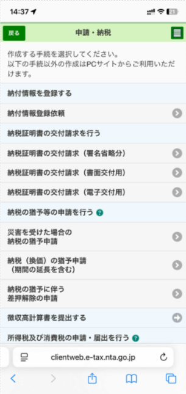
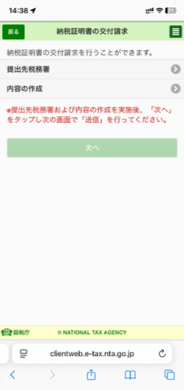
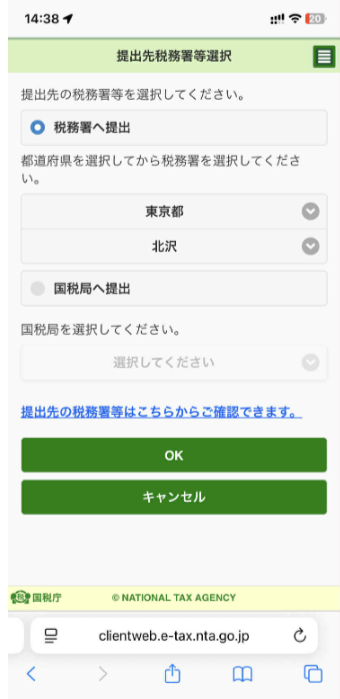
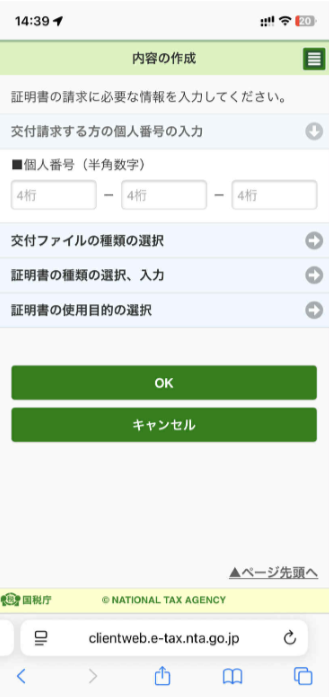
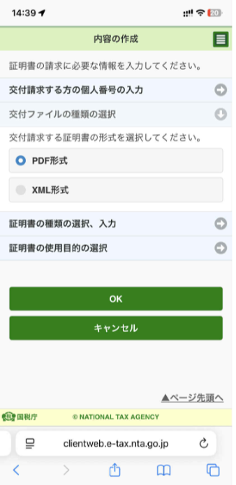
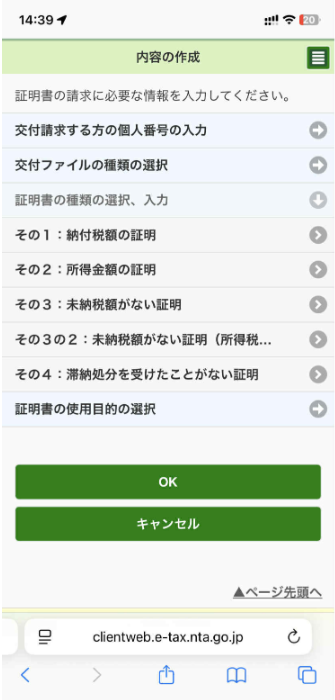
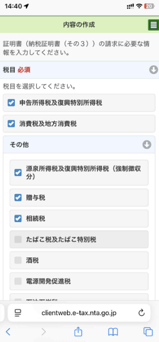

+++
date = '2025-09-06T08:16:20+09:00'
title = 'Hướng dẫn xin giấy tờ vĩnh trú và cách thức xin'
UseHugoToc = true
ShowToc = true
tags = ['vĩnh trú', '永住権', 'Nhật Bản', 'giấy tờ', 'hướng dẫn']
+++

## Hướng dẫn chi tiết từ Bộ tư pháp Nhật Bản tại đây

https://www.moj.go.jp/isa/applications/procedures/zairyu_eijyu03.html?hl=vi

## Giấy tờ

### Nenkin

#### ねんきん定期便

1. Login vào https://www3.idpass-net.nenkin.go.jp/
2. Trên menu bar trên cùng click: **通知書を確認する**
3. Có cái gì download được thì down hết.
   1. ねんきん定期便
   2. 被保険者記録照会回答票
   3. 国民年金保険料に関する通知書

#### 各月の年金記録

1. Login vào https://www3.idpass-net.nenkin.go.jp/
2. Trên menu bar trên cùng click: **年金記録を確認する**
3. Chọn **月別の年金記録を確認する**
4. Bên phải có nút tạo bản in
   
5. Chụp ảnh full màn hình

### 国税の納付状況を証明する資料

Phải xin cái **納税証明書（その３）**là loại chứng minh là mình không nợ tối đá 7-8 loại thuế gì đó. Nhưng để xin vĩnh trú chỉ cần 5 loại được liệt kê:

* 源泉所得税及び復興特別所得税
* 申告所得税及び復興特別所得税
* 消費税及び地方消費税
* 相続税
* 贈与税

Xin bằng cách login vào https://www.e-tax.nta.go.jp/ dùng Safari (iPhone) hoặc điện thoại nhé. Login bằng trình duyệt lạ hoặc trên PC toàn ra gì á.

1. Login bằng MyNumber (Myna Portal) nhé, không login bằng username + pass
2. Bấm **申請・納付手続を行う**
3. 
4. Bấm vào cái **納税証明書の交付請求（電子交付用）**
5. 
6. Ta cần nhập thông tin cho 2 mục này rồi cuối cùng ra ngoài bấm **次へ**
7. 
8. Nhập thông tin sở thuế mà địa chỉ của bạn thuộc về
9. OK thì quay lại màn hình trước
10. Bấm cái dưới là nội dung mình muốn xin cấp
11. 
12. Đầu tiên nhập mã số My number
13. 
14. Chọn output ra file PDF
15. 
16. Chọn **その３**
17. 
18. Chọn 5 loại thuế cần chứng minh là mình không nợ
19. Câu hỏi cuối hỏi mục đích xin làm gì thôi, chọn khác, rồi nhập vào là để xin Vĩnh Trú (永住許可申請のため)

Sau khi xong thì sẽ có mail báo về và chờ tầm 2-3 tiếng sẽ có mail báo là OK rồi đó. 
Vào trả tiền bằng cách chọn ngân hàng của bạn rồi login và thanh toán trực tuyến, hết 370 yên. 
Sau đó download là xong.

(Bài viết vẫn đang được cập nhật...)
